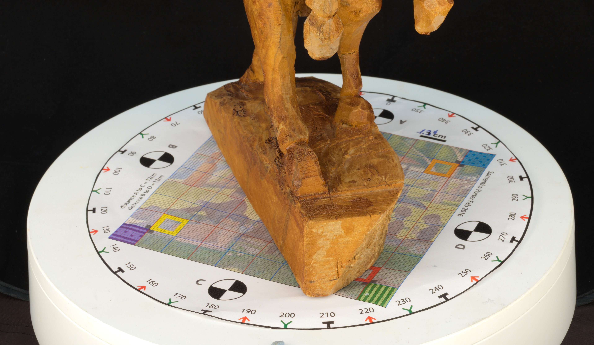
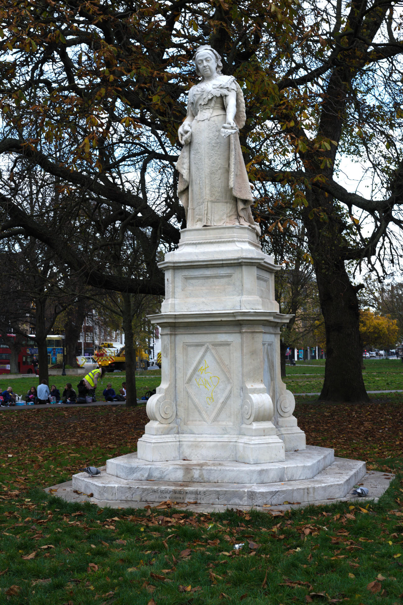
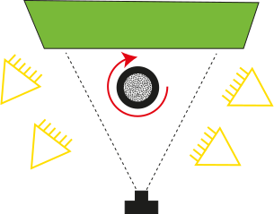
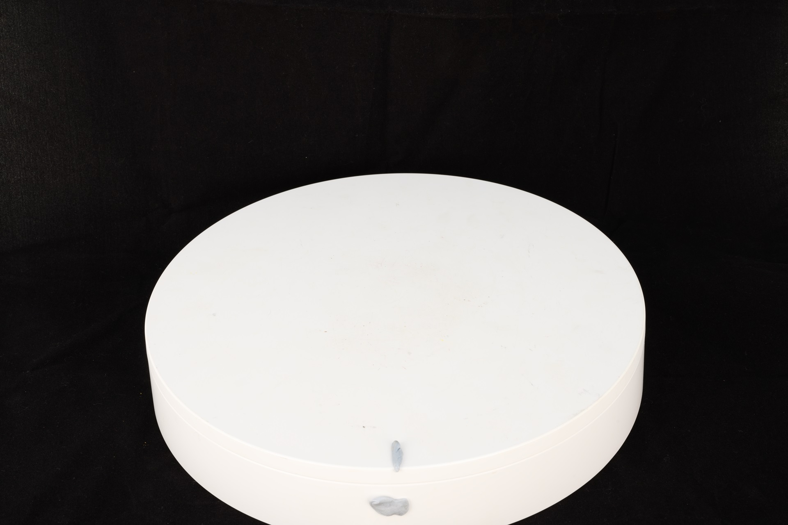
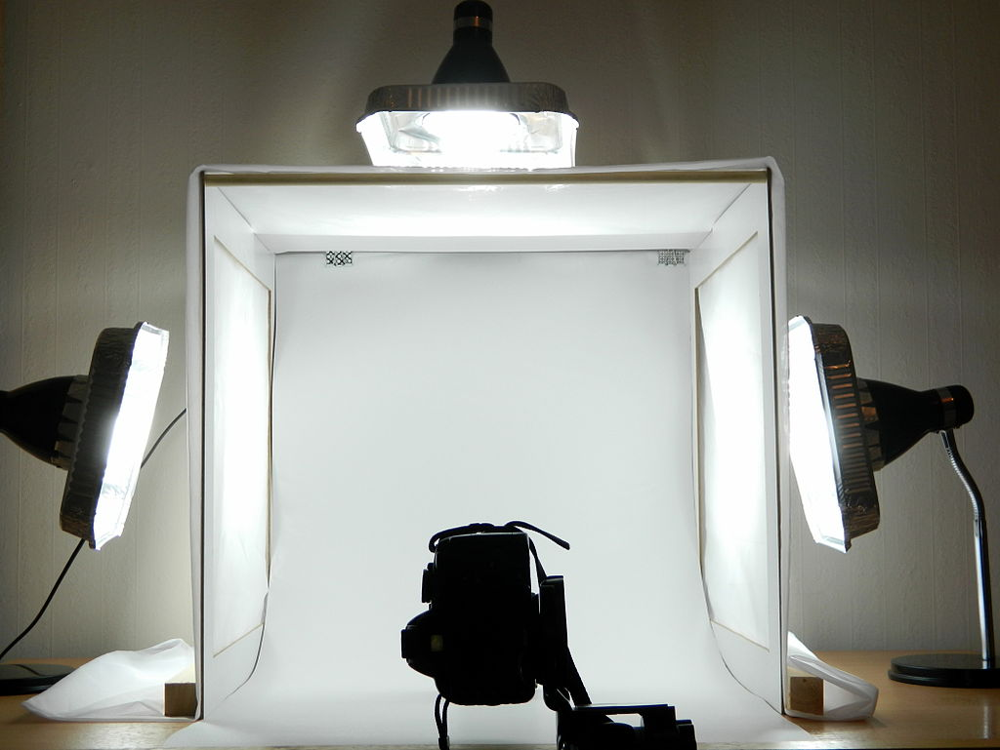
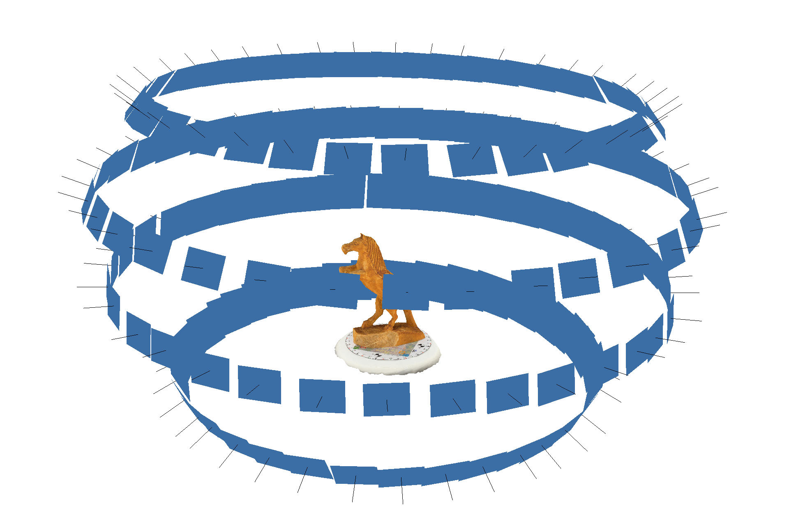
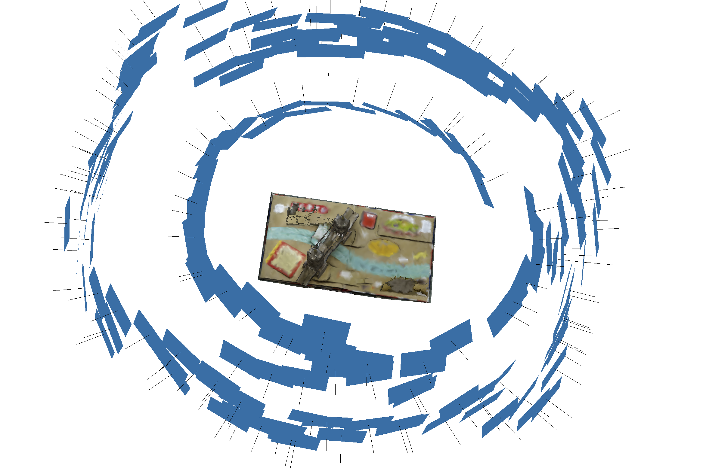

:::::::::::::::::::::::::::::::::::::: questions 

Guidance on how to take images. This lessons relies heavily on
learners practicing taking images of various objects.

:::::

## Camera considerations

Some knowledge in digital photography is useful for photogrammetry. In case you do not have
advanced skills, it is recommended that at least the following advice should
be followed.

## Resolution
Preferably shoot in **RAW** and in maximal resolution. JPG compression creates noise that should be avoided. If JPG images are to be used, then prefer high quality JPG images.

## ISO values
**ISO** values should be the **lowest possible** as you want **clear, sharp images** without too much noise. ISO 100 will provide good pictures without much noise but for this you will need a tripod because longer shutter speeds will be required. For hand-held camera you can go up to ISO 800 but this will bring more grain to your pictures.

## Aperture
**Aperture** value (f-number) should be **high enough** so as to be able to distinguish details without having blurred surfaces. A higher f-number means that you will get a **better depth of field**. Something between f/8 and f/16 would work well.

## Shutter speed
**Shutter speed** should be **fast enough** to freeze images and avoid blur that is caused by the movement of the camera. If you are using a tripod you can use slower shutter speeds. The rule here is that anything below **(slower) than 1/60 of a second requires a tripod**.

## Depth of field and focus
You should consider always a **large depth of field** when possible as **good focus** especially on the subject is important. 

{width="60%"}

Be careful to have all the important parts of the image in focus. Automatic focus can be used when you are rotating around the object, but you can set focus manually if you are using a turntable.

For a better explanation on how **depth of field** works in conjunction with **aperture, focal length and focus distance** you can refer to the website 

**Example of settings**: f/8, ISO 400, shutter speed 1/30 and if light isn’t enough you can increase ISO to 800 OR lower shutter speed to 1/15 (remember that any shutter speed that is lower than 1/60 requires a tripod). Please note that these are just examples and you should check exposure for every acquisition depending on current light conditions.

More information:

- Cambridge in Color: [https://www.cambridgeincolour.com/tutorials/depth-of-field.htm](https://www.cambridgeincolour.com/tutorials/depth-of-field.htm)
- Photographylife: [https://photographylife.com/what-is-depth-of-field](https://photographylife.com/what-is-depth-of-field)

## Before you start

Before embarking on photogrammetry, consider the
object you want to digitise and the space available
to do this. You might want to ask yourself?

- Does the object has enough texture for the
software to find enough features?
- If outdoors, is the building or environment
in a busy area with passers by or lots of foliage?
- Will I use artificial or natural light to best 
illuminate the object?
- What equipment will I need with me if I need
to travel to perform the digitisation?

Overall, the recommendation is to **avoid plain and monotonous surfaces**. Flat, shiny, transparent, very thin artefacts and textures such as fur, hair won’t be the ideal candidates for photogrammetry. 

**Moving objects** (e.g. leaves of a tree or people walking)  are not good candidates either. 

Some objects are **shinny** and the **reflections** will result in having lots of noise, hence a ‘bad’ model. Adding talc or corn-starch on the surface of the object could be a solution but this cannot be applied on most cultural heritage artefacts.

Significant colour changes or colour designs on a relatively plain surface could provide good reference points and help us to produce a model. 

The best candidates are rigid, non-reflective, textured artefacts.

## Photographing the object/environment

Good acquisition of images is important in order to have a successful project. 

Depending on the type of the object and scene you want to acquire, you might be able to create an optimal setup
which can allow you to develop a workflow to provide you with a good 3D model. 

Thankfully, there is guidance and best practices, provided by independent bodies and software companies. For example, see the [3D Flow](https://www.3dflow.net/technology/documents/photogrammetry-how-to-acquire-pictures/) software guidance. We will be using this software in this workshop.

In general, start the acquisition from an angle/view of the object that has many details and is not very plain. Thereafter,
you need to take images around the object as shown in the image below.

### Overlapping
In all cases you need many
overlapping images of the object or environment.
When taking images, you need enough overlap between, 
around 50-60%, to make sure that the software will be 
able to align the images correctly. 

### Number of images
20-60 for each 360 acquisition. Remember that it is better to have more images than less. ‘Bad’ images (e.g. blurred, not in focus) can be deleted before processing.

Remember that you should avoid having ‘blind-zones’ and the object should occupy the maximum possible frame area. 

Close-up photos are allowed only to capture minor details.

### Targets/markers
You can put some markers and targets on/around/underneath the object that you want to acquire to help the software with the aligning process. 

To support accurate measurements of 3D data you can also place a calibrated scale image underneath the object (or scale bars around it). 

You can use these two images which contain both 
a texture, as well as a scale image. Follow the instructions, including printing in colour and
at 1:1 scale:

- [20 cm diameter marker image](files/photogrammetric_scale_noncoded_markers_medium.pdf)
- [12 cm diameter marker image](files/Photogrammetric_scale_noncoded_markers_plus_small.pdf)

Remember that these points should remain in the same position with respect to the object. 

{width="100%"}

So, if you move with the camera around the object they should remain in the same place (e.g. placed around the object). But if you are using a turntable they should turn along with the object (e.g. placed underneath the object).

### Lighting
Good lighting is required and occlusions should be kept to minimum. 

The ideal conditions for an outdoor acquisition require an overcast/cloudy day. 

If there is sun that creates shadows, you can use a sheet to shade the object of interest. But for buildings,
it might not be possible as illustrated below.

, via [Wikimedia Commons](https://commons.wikimedia.org/wiki/File:D%C3%BClmen,_St.-Viktor-Kirche_--_2014_--_0076.jpg)](https://upload.wikimedia.org/wikipedia/commons/b/b7/D%C3%BClmen%2C_St.-Viktor-Kirche_--_2014_--_0076.jpg){width="50%"}

{width="50%"}

For
indoor acquisition, you can use static artificial light. In this case, lights should have the same intensity. 

It is better to use diffused light that is projected on every surface of the object equally. 

Two light sources can be placed on the sides of the object at an angle of 45 degrees and one can come from the top. 

Shadows should be avoided as much as possible (thus you might want to add more light sources, for example one at the back).

### Background
This should be kept simple and plain. 

There should be high contrast between the object and the background (e.g. dark object requires bright background).

## Types of setup
There are two different types of setup which you can
use depending on the equipment and accesories
you have access to. Their difference is
whether the camera or the object remains static.

In cases where you cannot touch the object,
then you will only have one choice: to move the camera.

In all cases you can create various series of
images by varying the height of your camera. For this,
you can raise or lower as well as adjust the angle of the camera to take another series of photos. 

### Static camera / move object
In this setup the camera is going to remain 
static on a tripod. Ideally you want to
control the camera remotely to avoid small
movements which can be caused by your hand
pushing the trigger.

{alt="static camera"}

The object is then placed on a turntable.
Ideally, a turntable which is controlled remotely
works best. As again, you want to minimise
movements caused unintentionally on the object's
position.

To avoid the software getting confused
on the object moving but the background remaining static,
you can use a box or cloth as a background. 

Black or 
white background work better as you want to avoid reflections
onto the object and alter its colour. Black is always a safe choice.

We will later mask the background, so that the software ignores it. To help with this, take an image of the setup
without the object before placing the object. This will later become useful
when applying the mask to the images.

{width="60%"}

If artificial light is used, this should be diffused and should not create shadows. 

{alt="turntable" width="60%"}

, via [Wikimedia Commons](https://commons.wikimedia.org/wiki/File:Balkan_Heritage_Field_School-5.jpg) ](https://upload.wikimedia.org/wikipedia/commons/d/d3/Balkan_Heritage_Field_School-5.jpg){width="60%"}

The camera should be placed at a height that allows to see all important features of the artefact (e.g. at an angle of 45 degrees above the object). 

When you photograph, rotate the turntable in small
increments.

The advantage of this method is that you can have lower ISO and shutter speeds and thus sharper images (especially in indoor environments).

{width="100%"}

Here you can also find a [**video**](https://www.youtube.com/watch?v=Fj7wGGXPM0A) of a DIY rig that aims to speed up the process when shooting small and medium objects by [**Openscan.eu**](https://en.openscan.eu/).

### Static object / move camera

The object is placed at the centre and
the photographer moves around it 
taking pictures. 

{alt="static object"}

Place the item at a good height so that it 
is possible to take images from a higher and a lower level.

In case some areas are not that visible, remember to take different pictures of that part from different angles. 

The advantage of this method is that it will allow you to acquire larger objects without setting up lights.

{alt="static obj"}
:::: challenge

## Challenge: Taking photos

***This activity can be done as a team***

Experiment with both setups for photographing one or more objects relevant to your project.
When doing this consider the best practices, including:

- Best camera and area setup.
- Adding scale to the images.
- How many series of images you plan to acquire and what is the strategy to achieve this.

:::: 
